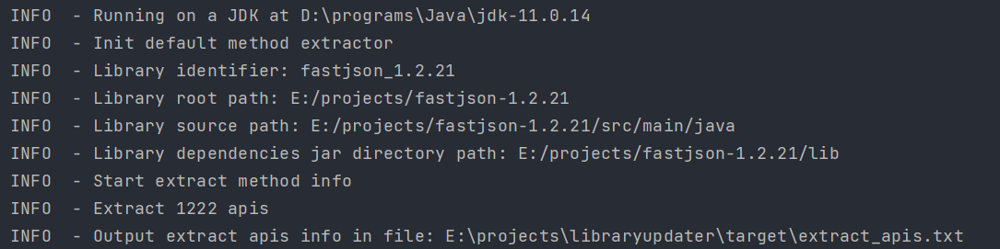
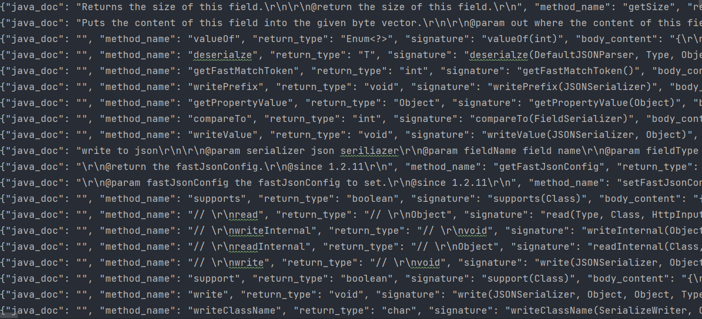
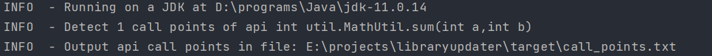
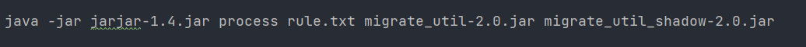
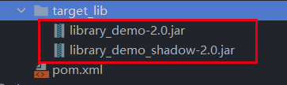
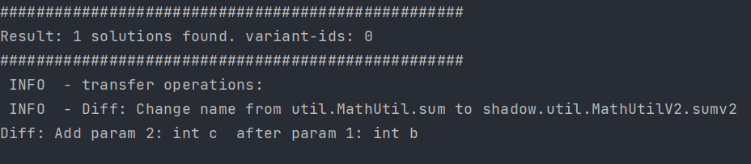
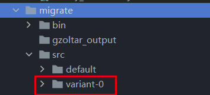
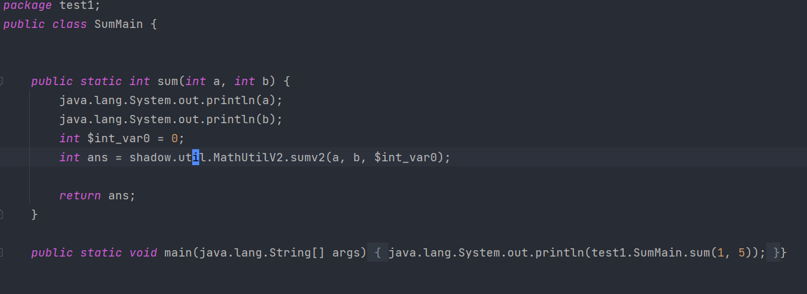

# Java 软件库API迁移工具使用指南

## 一、工具功能

### 1、软件库API信息提取

基于对软件库程序源码进行静态分析，提取软件库API的签名、参数名称和类型信息、返回值类型信息、JavaDoc注释信息、API实现代码等信息，用于软件库API的变更分析。

### 2、软件库API调用点检测

指定软件库API签名，可以从客户端代码中提取所有的对该API的调用点的检测。

### 3、多种模式软件库API迁移

工具能够对客户端代码中的API调用点尝试进行迁移，并支持多种迁移模式，能够使用不同的迁移策略尝试进行迁移。

## 二、功能使用示例

### 软件库API信息提取

**（1）准备软件库源码即依赖库**

我们需要软件库项目源码以及依赖的软件库jar包（为了对库源码转换为抽象语法树并进行符号解析），目依赖的jar包默认存放在项目根目录下的lib目录中。

maven项目可以通过以下命令自动将项目依赖的jar包下载保存到lib目录下：

```shell
mvn dependency:copy-dependencies -DoutputDirectory=lib
```

**（2）在配置文件conf.properties中配置软件库项目信息**

```properties
########################################
# library api extractor conf
########################################
# library identifier: name_version
library_identifier=fastjson_1.2.21
# library project root path
library_root_path=E:/projects/fastjson-1.2.21
# library project src path
library_src_path=E:/projects/fastjson-1.2.21/src/main/java
# library project dependencies jar path
library_dependency_path=E:/projects/fastjson-1.2.21/lib
```

**（3）通过命令行启动工具，提取的API信息将输出到名为extract_apis.txt的文件中**

```shell
java -jar .\entrance-jar-with-dependencies.jar -mode extract -file ..\src\main\resources\conf.properties
```

> 命令行参数：
> 
> -mode: 指定工具执行的操作，extract为提取软件库API信息
> 
> -file: 指定配置文件路径

获得数据结果如下：



日志输出了提取的软件库API概要信息，以及输出的结果文件路径。

打开结果文件，其中包含提取的软件库API的相关信息。




### 软件库API调用点检测

**（1）准备客户端项目源码及依赖库**

maven项目可以通过以下命令自动将项目依赖的jar包下载保存到lib目录下：

```shell
mvn dependency:copy-dependencies -DoutputDirectory=lib
```

**（2）在配置文件conf.properties中配置客户端项目信息及API信息**

```properties
######################################
# migrate client project conf
######################################
# project info
project_name=api_migrate
# location of project to migrate
location=E:/projects/libraryupdater/examples/migration_test_demo
# dependencies jar folder path of project to migrate
dependencies_path=E:/projects/libraryupdater/examples/migration_test_demo/lib
# original source code of project to migrate
original_dir_src=src/main/java
# original byte code of project to migrate
original_dir_bin=target/classes
# original test source code of project to migrate
original_dir_test=src/test/java
# original test source code of project to migrate
original_dir_test_bin=target/test-classes
# original source code of project to migrate
...
origin_api=int util.MathUtil.sum(int a,int b)
```

**（3）通过命令行启动工具，检测的客户端代码中的API调用点将输出到名为call_points.txt的文件中**

```shell
java -jar .\entrance-jar-with-dependencies.jar -mode detect -file ..\src\main\resources\conf.properties
```

> 命令行参数：
>
> -mode: 指定工具执行的操作，detect为检测客户端代码中的指定API的调用点
>
> -file: 指定配置文件路径

获得数据结果如下：



日志输出了检测的API调用点概要信息，以及输出的结果文件路径。

打开结果文件，其中包含API调用点信息。


### 软件库API迁移
#### 工具原理

##### 迁移场景

对于待迁移客户端项目client，初始时其源码中调用了旧版本软件库lib1的api1，且可能包含了多个对api1的调用点，而迁移的目标是将所有对lib1的api1的调用点替换为对新版本软件库lib2的对应api2的调用。

##### 迁移原理

1. 在待迁移客户端项目中检测旧版本软件库指定API的所有调用点
2. 针对每一个API调用点，进行如下操作:
   1. 分析旧版本软件库API与新版本软件库API之间发生的变更；
   2. 将变更在客户端API调用点对应的AST结构上进行重放，完成新API调用的替换；
   3. 对修改后的程序变体进行动态编译，检验是否存在编译错误；
   4. 对编译通过的程序变体执行单元测试，程序变体是否正确；
   5. 针对测试结果，筛选通过率较高的变体，选择合适的突变操作（如替换API参数等），对程序变体进行调整；
   6. 通过多轮迭代获得正确的程序迁移适配代码。

##### 操作步骤

###### 1、准备客户端项目代码和依赖软件库

目前工具只针对maven构建的客户端项目代码进行迁移，准备好项目源码，用于后续API调用点提取和分析

同时，我们需要客户端项目依赖的软件库jar包（为了对待迁移项目源码转换为抽象语法树并进行符号解析，除了需要项目源码，同时需要依赖库jar包），我们将客户端项目依赖的jar包默认存放在项目根目录下的lib目录中。

maven项目可以通过以下命令自动将项目依赖的jar包下载保存到lib目录下：

```shell
mvn dependency:copy-dependencies -DoutputDirectory=lib
```

###### 2、准备迁移的目标版本软件库jar包

由于在迁移过程中，需要对客户端源码中原始版本软件库的API进行替换，将其替换为新版本软件库API，因此，需要准备好相应新版本软件库的jar文件，我们默认存放在项目根目录的target_lib文件夹下

**注意：需要对新版本软件库进行预处理**

由于我们对客户端项目中的所有API调用点是逐个进行迁移的，因此，当正在迁移的API调用点替换为新版本软件库后，其他剩余的API调用点使用的依旧是旧版本软件库的API，这意味着，在迁移期间，客户端项目需要同时使用新、旧两个版本软件库的jar包。

而由于Java语言中JVM的类加载机制，对于classpath中存在的两个不同版本的同名软件库，只会默认加载其中一个，无法同时加载使用两个不同版本，因此，为了能够达到在迁移期间同时使用两个不同版本软件库的目的，我们需要对新版本软件库jar进行一定的特殊处理：**对目标版本软件库jar包内的所有类路径进行临时重命名，以达到避免JVM加载类时的名称冲突问题**。

包名的转换操作可以按如下步骤进行：

####### 1、编写包名替换规则

在script目录下的rule.txt中，编写包名替换规则。


如图，将源版本软件库中所有util包内的类的包路径替换为shadow.util，默认在所有包名前添加shadow。

####### 2、执行软件库包名转换

我们使用jarjar-1.4.jar工具来实现对jar包中类路径的重命名步骤，该工具由google实现。

在script目录下的jar_shadow.bat脚本中指定需要转换的jar包名称和转换后jar包名称。



####### 3、执行jar_shadow.bat脚本对目标版本软件库的包名进行转换。

如图所示的示例软件库library_demo-2.0.jar中util包下的类，被重命名为了shadow.util包。同时，新jar包的名称为migrate_demo_shadow-2.0.jar。


###### 配置运行参数

本API迁移工具的所有配置参数都在src/main/resources目录下的conf.properties文件内。

在文件中可以指定待迁移项目、需要迁移的api等参数

核心参数即说明如下：

```properties
####################################################
# 客户端项目相关信息配置
####################################################
# 待迁移的客户端项目根目录
location=E:/projects/libraryupdater/examples/migration_test_demo
# 待迁移客户端项目的依赖jar包的目录（默认在项目根目录的lib文件夹下）
dependencies_path=E:/projects/libraryupdater/examples/migration_test_demo/lib
# 客户端项目的源码路径
original_dir_src=src/main/java
# 客户端项目存放编译后字节码的目录
original_dir_bin=target/classes
# 客户端项目存放单元测试源码的目录
original_dir_test=src/test/java
# 客户端项目存放单元测试代码编译后字节码的目录
original_dir_test_bin=target/test-classes

####################################################
# 迁移软件库相关配置信息
####################################################
# 源版本软件库位置
source_library_path=E://projects//libraryupdater//examples//migration_test_demo//lib//migrate_demo-1.0.jar
# 目标版本软件库位置
target_library_path=E://projects//libraryupdater//examples//migration_test_demo//target_lib//migrate_demo_shadow-2.0.jar
# API签名的参数列表中的’,‘间不要添加空格，避免解析错误
# 源版本软件库API签名
origin_api=int util.MyMathUtil.sum1(int a,int b)
# 预计要迁移的目标版本软件库API签名（包路径按重命名后的路径填写）
target_api=int shadow.util.MyMathUtil.sum2(int a,int b,int c)

####################################################
# 迁移输出相关配置 
####################################################
# 迁移结果输出的根目录，默认会在当前项目的根目录下生成一个migrate目录，作为迁移的工作目录和结果输出的根目录
working_dir_root=E:/projects/libraryupdater/examples/migration_test_demo/migrate
# 存放程序变体的程序源码，默认再migrate/src目录下，该目录下，按程序变体编号为子目录分别存放每个变体的代码
working_dir_source_code=E:/projects/libraryupdater/examples/migration_test_demo/migrate/src
# 存放程序变体编译后字节码的目录，默认为migrate/bin，该目录下，按程序变体编号为子目录分别存放每个变体的字节码
working_dir_bytecode=E:/projects/libraryupdater/examples/migration_test_demo/migrate/bin

####################################################
# 单元测试相关配置信息 
####################################################
# 是否将单元测试结果输出到文件
junit_process_output_to_file=true
# 用于执行单元测试的JVM安装路径
jvm_for_test_execution=D:/programs/Java/jdk-11.0.14/bin
# maven的安装路径
mvn_dir=D:/programs/apache-maven-3.2.5/bin

####################################################
# 迁移工具其他相关配置
####################################################
# 程序变体的验证方式，目前只有一种基于进程执行Junit单元测试的方式
validation_type=process
# 使用的迁移引擎选择，当前支持2种：（1）default：只执行基础的API变更转换（2）generate_validate：在（1）的基础上，增加多轮迭代的代码突变搜索流程
migration_mode=generate_validate
# 程序突变过程中每轮迭代的种群大小
population_size=200
```

#### 4、执行迁移

通过命令行启动工具

```shell
java -jar .\entrance-jar-with-dependencies.jar -mode migrate -file ..\src\main\resources\conf.properties
```

> 命令行参数：
>
> -mode: 指定工具执行的操作，migrate为API迁移
>
> -file: 指定配置文件路径

当找到正确的迁移代码时，日志会输出相关适配代码变体的信息，如变体id和相应的转换操作描述。



生成的迁移适配代码在客户端项目根目录下名为migrate/src/的目录中，以"variant-id"命名的文件夹下，id为日志中输出的结果id。



其中包含了相关的迁移适配代码。



## 注意事项

### 1、基于进程的命令行调用的平台适配问题

程序中许多步骤依赖Process类创建新进程执行，如下载maven项目依赖jar包、执行单元测试等，对于不同平台（windows、linux等），命令行构建略有不同，目前只支持windows平台下的命令行调用，若需要在linux平台下执行，需要做相应的修改。
